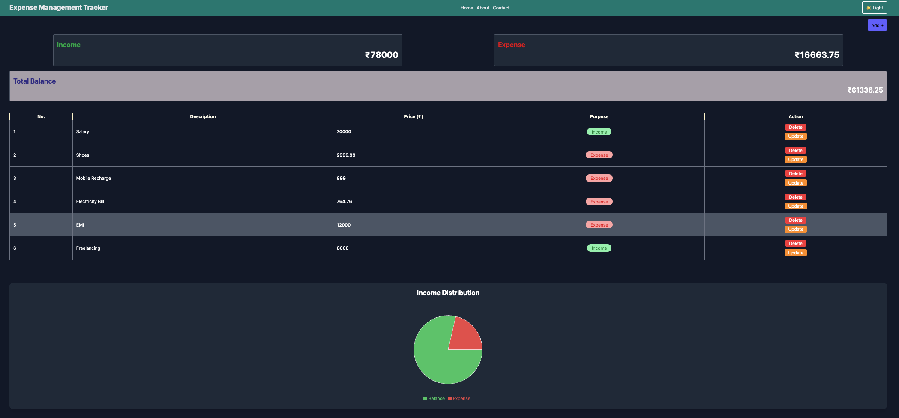
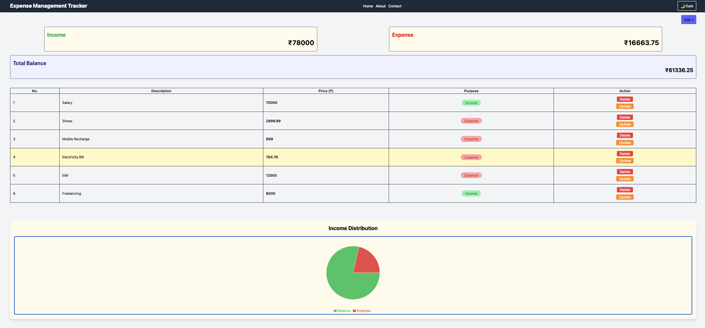

<div align="center">

# 💰 Expense Tracker Dashboard

[](https://git.io/typing-svg)


</div>

> A modern React-based expense management dashboard featuring CRUD transactions, interactive financial analytics, responsive design, dark/light themes, and persistent local storage.

---

## 🚀 Features

### 💳 Transaction Management

- Add income and expense transactions
- Update existing transactions
- Delete transactions

### 📊 Analytics & Visualization

- Real-time balance calculation
- Interactive Expense vs Balance Pie Chart
- Automatic income, expense, and balance updates

### 🎨 User Experience

- Responsive dashboard layout
- Dark & Light theme support
- Clean and intuitive interface
- SweetAlert2 notifications

### 💾 Data Persistence

- Browser LocalStorage persistence
- React Context API state management

---

## 🌐 Live Demo

🔗 **Try the application here:**

https://expense-tracker-dashboard-rho.vercel.app/

---

## 📊 Dashboard Preview

The application supports both **Light** and **Dark** themes, providing a responsive and user-friendly interface across different viewing preferences.

<div align="center">

### 🌙 Dark Mode



<br><br>

### ☀️ Light Mode



</div>

---

## 🔄 Project Workflow

```text
                                  User Interaction
                                        │
                                        ▼
                                  React Components
                                        │
                                        ▼
                                  Context API 
                                        │
                                        ▼
                                 State Management
                                        │
                                        ▼
                                  LocalStorage
                                        │
                                        ▼
                                Dashboard Update
                                        │
                                        ▼
                            Charts & Analytics Refresh
```

---

## 🛠 Tech Stack

| Technology | Purpose |
|------------|---------|
| React.js | Frontend Framework |
| Context API | Global State Management |
| Tailwind CSS | UI Styling |
| Recharts | Data Visualization |
| SweetAlert2 | Interactive Alerts |
| LocalStorage | Data Persistence |
| Vite | Development & Build Tool |

---
---

## 📂 Project Structure

```text
expense-tracker-dashboard/
│
├── Images/
│   ├── Dark_Dashboard.png
│   └── Light_Dashboard.png
│
├── public/
│   ├── favicon.svg
│   └── icons.svg
│
├── src/
│   ├── assets/
│   ├── components/
│   ├── context/
│   ├── App.jsx
│   ├── index.css
│   └── main.jsx
│
├── .gitignore
├── eslint.config.js
├── index.html
├── package.json
├── package-lock.json
├── tailwind.config.js
├── vite.config.js
└── README.md
```

---

## ⚙️ Installation

Clone repository:

```bash
git clone https://github.com/RakshatTiwari/expense-tracker-dashboard.git
```

Install dependencies:

```bash
npm install
```

Run project:

```bash
npm run dev
```

---

## 💡 Future Improvements

- Search transactions
- Filter by category
- Export CSV
- Budget tracking
- Authentication system

---

## 👨‍💻 Author

**Rakshat Tiwari**

---

<div align="center">

### ⭐ If you found this project useful, consider giving it a Star!

</div>